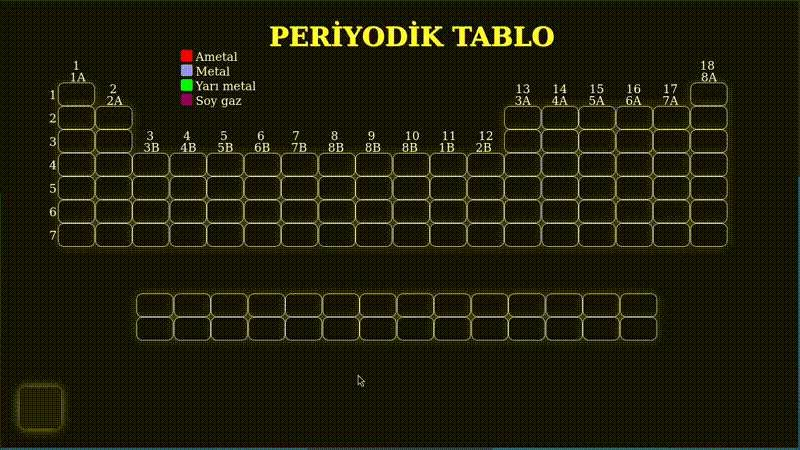

# ⚛️ İnteraktif Periyodik Tablo

[](../LICENSE)
[](https://github.com/usama-kanjo/periyodik-tablo-js/stargazers)
[](https://github.com/usama-kanjo/periyodik-tablo-js/network/members)
[](https://developer.mozilla.org/tr/docs/Web/HTML)
[](https://developer.mozilla.org/tr/docs/Web/CSS)
[](https://developer.mozilla.org/tr/docs/Web/JavaScript)

HTML, CSS ve JavaScript kullanılarak geliştirilmiş interaktif ve responsive periyodik tablo uygulaması. 5 yıl önce başlanmış ve güncellenmiştir.

## 🎬 Canlı Demo

### Ana Özellikler


## ✨ Özellikler

- **Tüm Elementler**: 118 kimyasal elementin görsel olarak düzenlenmesi
- **İnteraktif Detaylar**: Elementlere tıklayarak animasyonlu detay bilgileri
- **Tamamen Responsive**: Masaüstü, tablet ve mobil uyumlu
- **Modern Arayüz**: Temiz tasarım, geçiş efektleri
- **Bağımlılık Yok**: Framework kullanılmadan geliştirildi
- **Hızlı Performans**: Hafif ve anında yüklenir

## 🛠️ Kullanılan Teknolojiler

| Teknoloji | Amacı |
|-----------|-------|
| **HTML5** | Yapısal işaretleme |
| **CSS3** | Stil, animasyon ve responsive tasarım |
| **Vanilla JavaScript** | Etkileşim ve dinamik içerik |
| **PHP** | Backend veri işleme (gerekirse) |

## 📁 Proje Yapısı

```
interactive-periodic-table/
├── index.html              # Ana giriş noktası
├── style.css              # Ana stil dosyası
├── style1.css             # Ek stil modülleri
├── style2.css
├── style3.css
├── script.js              # Temel JavaScript fonksiyonları
├── php.php                # PHP backend mantığı
├── demo.gif               # Ana demo (otomatik oynar)
├── demo-mobile.gif        # Mobil uyumluluk demo
├── README.md              # İngilizce dokümantasyon
├── docs/                  # Dokümanlar
│   └── README_TR.md       # Türkçe dokümantasyon (bu dosya)
├── video/                 # Orijinal video kayıtları
│   └── demo.mp4
└── .git/                  # Versiyon kontrolü
```

## 🚀 Hızlı Başlangıç

### Tüm Kullanıcılar İçin
1. Depoyu klonlayın:
   ```bash
   git clone https://github.com/usama-kanjo/interactive-periodic-table.git
   cd interactive-periodic-table
   ```

2. `index.html` dosyasını tarayıcınızda açın:
   - Dosyaya çift tıklayın, veya
   - Tarayıcı penceresine sürükleyip bırakın

### Linux Kullanıcıları İçin (Önerilen Yöntemler)

#### **Seçenek 1: VS Code Live Server** 🎯
```bash
# VS Code kurun (yoksa)
sudo apt update
sudo apt install code

# Projeyi VS Code'da açın
code .

# 'Live Server' eklentisini kurun
# index.html'e sağ tıklayın → 'Open with Live Server'
# Otomatik olarak http://localhost:5500 adresinde açılır
```

#### **Seçenek 2: Python HTTP Sunucusu**
```bash
cd ~/Github/interactive-periodic-table
python3 -m http.server 8080
# http://localhost:8080 adresini ziyaret edin
```

#### **Seçenek 3: PHP Dahili Sunucusu**
```bash
cd ~/Github/interactive-periodic-table
php -S localhost:8000
# http://localhost:8000 adresini ziyaret edin
```

#### **Seçenek 4: Direkt Tarayıcıdan Açma**
```bash
firefox index.html
# veya
google-chrome index.html
# veya
chromium index.html
```

## 🎮 Nasıl Kullanılır

1. **Elementleri Keşfedin**: Periyodik tabloda gezinin
2. **Detayları Görüntüleyin**: Herhangi bir element kartına tıklayın
3. **İnteraktif Özellikler**:
   - Elementlerin üzerine gelin (hover)
   - Tıklayarak animasyonlu detayları görün
   - Responsive tasarım ekran boyutuna uyum sağlar
4. **Navigasyon**: Detayları kapatmak için dışarı tıklayın veya ESC tuşunu kullanın

## 🔧 Geliştirme

### Dosya Organizasyonu
Proje, daha iyi bakım için modüler CSS kullanır:
- `style.css`: Ana layout ve global stiller
- `style1.css`: Element kart tasarımları
- `style2.css`: Animasyon ve geçişler
- `style3.css`: Responsive breakpoint'ler

### Tarayıcı Uyumluluğu
- ✅ Chrome 60+
- ✅ Firefox 55+
- ✅ Safari 11+
- ✅ Edge 79+
- ✅ Opera 50+

## 🤝 Katkıda Bulunma

Katkılarınızı bekliyoruz! Nasıl yardımcı olabileceğiniz:

1. Depoyu fork'layın
2. Feature branch oluşturun (`git checkout -b feature/HarikaOzellik`)
3. Değişikliklerinizi commit'leyin (`git commit -m 'Harika bir özellik ekle'`)
4. Branch'inize push'layın (`git push origin feature/HarikaOzellik`)
5. Pull Request açın

### Geliştirilebilecek Alanlar
- Arama/filtreleme özelliği ekleme
- Karanlık/açık tema değiştirici
- Element karşılaştırma özelliği
- Tarihsel bilgiler ekleme
- Quiz/öğrenme modu ekleme

## 🐛 Sorun Giderme

### Yaygın Sorunlar

| Sorun | Çözüm |
|-------|-------|
| Stiller yüklenmiyor | Tüm CSS dosyalarının aynı dizinde olduğundan emin olun |
| JavaScript hataları | Tarayıcı konsolunu kontrol edin (F12) |
| PHP çalışmıyor | PHP sunucusu ile çalıştırın (Seçenek 3) |
| GIF'ler animasyonlu değil | README.md'deki dosya yollarını kontrol edin |

### Hızlı Düzeltmeler
```html
<!-- HTML dosyanızda bu satırların olduğunu doğrulayın -->
<link rel="stylesheet" href="style.css">
<link rel="stylesheet" href="style1.css">
<link rel="stylesheet" href="style2.css">
<link rel="stylesheet" href="style3.css">
<script src="script.js"></script>
```

## 📄 Lisans

Bu proje MIT Lisansı altında lisanslanmıştır - detaylar için [LICENSE](../LICENSE) dosyasına bakın.

## 👨‍💻 Yazar

**Adınız**
- GitHub: [@usama kanjo](https://github.com/usama-kanjo)
- Proje: [Interactive Periodic Table](https://github.com/usama-kanjo/interactive-periodic-table)

## 🙏 Teşekkürler

- Periyodik tablo verileri bilimsel kaynaklardan alınmıştır
- Kimya eğitim araçlarından ilham alınmıştır
- İkonlar [Font Awesome](https://fontawesome.com) sitesinden
- Renk paleti [Coolors](https://coolors.co) sitesinden

---

⭐ **Bu projeyi faydalı bulduysanız, lütfen GitHub'da yıldız verin!**

---

## 🌍 Diğer Diller
- [English Documentation](../README.md)